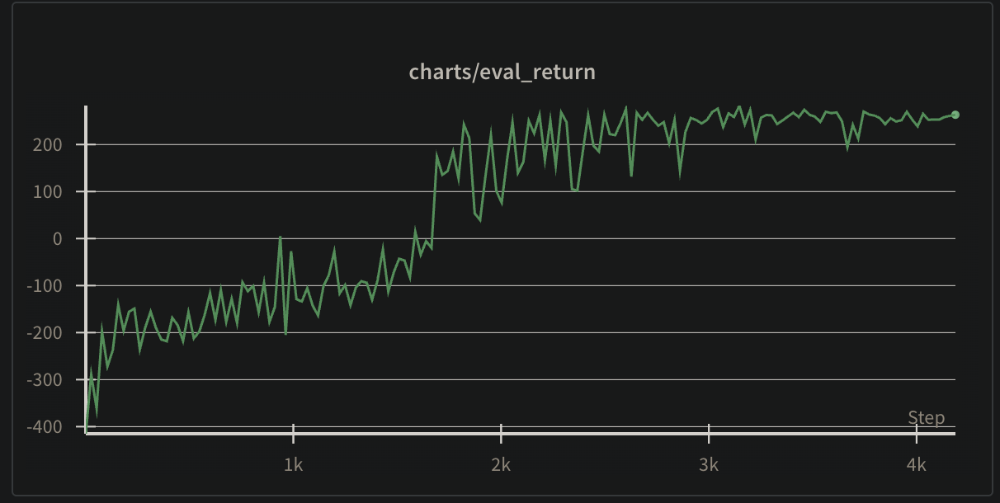
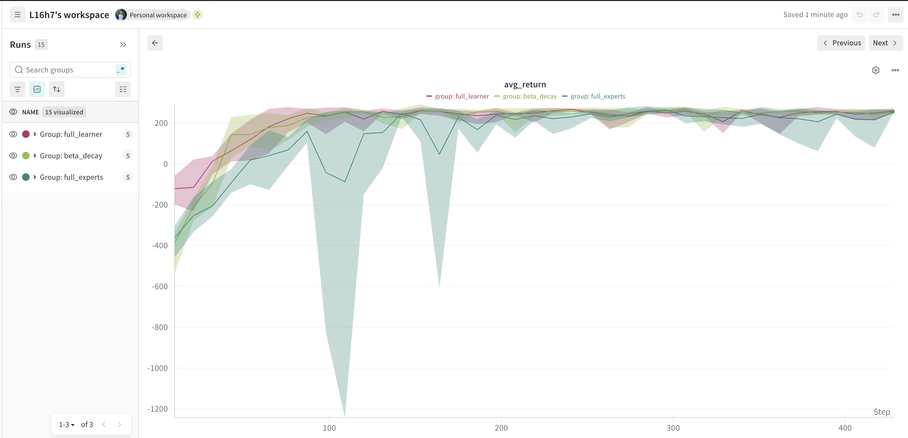
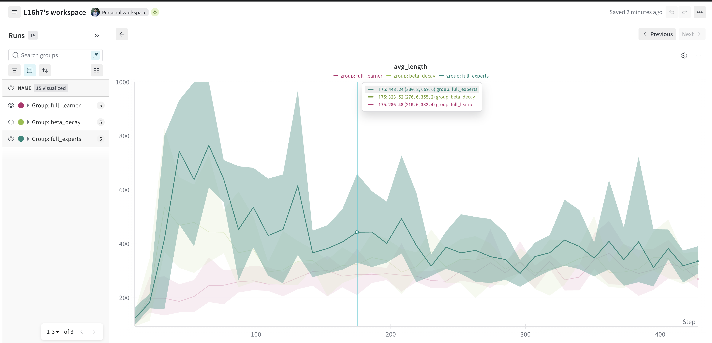

# Lunar-DAgger — DAgger training on LunarLander

This repository contains an implementation of Dataset Aggregation (DAgger) used to train a continuous LunarLander environment (based on Gymnasium). The training script logs metrics to Weights & Biases and writes checkpoints into the `dagger_checkpoints/` folder.

---

## Expert Training


The expert is trained using Soft Actor-Critic (SAC) with the following hyperparameters:

- alpha: 0.2 (entropy regularization)
- batch_size: 256
- buffer_size: 1,000,000
- checkpoint_dir: "checkpoints"
- eval_interval: 1,000
- gamma: 0.99 (discount factor)
- learning_starts: 1,000
- log_interval: 40
- num_envs: 64
- policy_update_freq: 2
- seed: 42
- target_update_freq: 1
- tau: 0.005

```bash
python sac.py \
  --num-envs 64 \
  --batch-size 256 \
  --buffer-size 1000000 \
  --alpha 0.2 \
  --gamma 0.99 \
  --learning-starts 1000 \
  --log-interval 40 \
  --eval-interval 1000 \
  --policy-update-freq 2 \
  --target-update-freq 1 \
  --tau 0.005 \
  --checkpoint-dir checkpoints \
  --seed 42 \
  --total-timesteps 5000000
```

## DAgger Training

DAgger is trained with default hyperparameters, except for `--beta` and `--beta-decay`

```bash
python dagger.py --total-timesteps 100_000 --beta 1 --beta-decay 0.99
```

I am just curious about training with

1. full experts, basic supervised learning
2. full learner, learner acts all the time and expert corrects the time.
3. DAgger with decaying beta, starting from expert actions only to learner actions only.

Each experiment is run with 5 different seeds.

## Hypothesis

My hypothesis is standard DAgger with decaying beta should perform best and full learner should perform worst.

## Results

Full learner performs the best. Full expert performs the worst. DAgger with decaying beta is in between.

## Explanation

I am now comtemplating why.

### DAgger returns



### DAgger lengths


